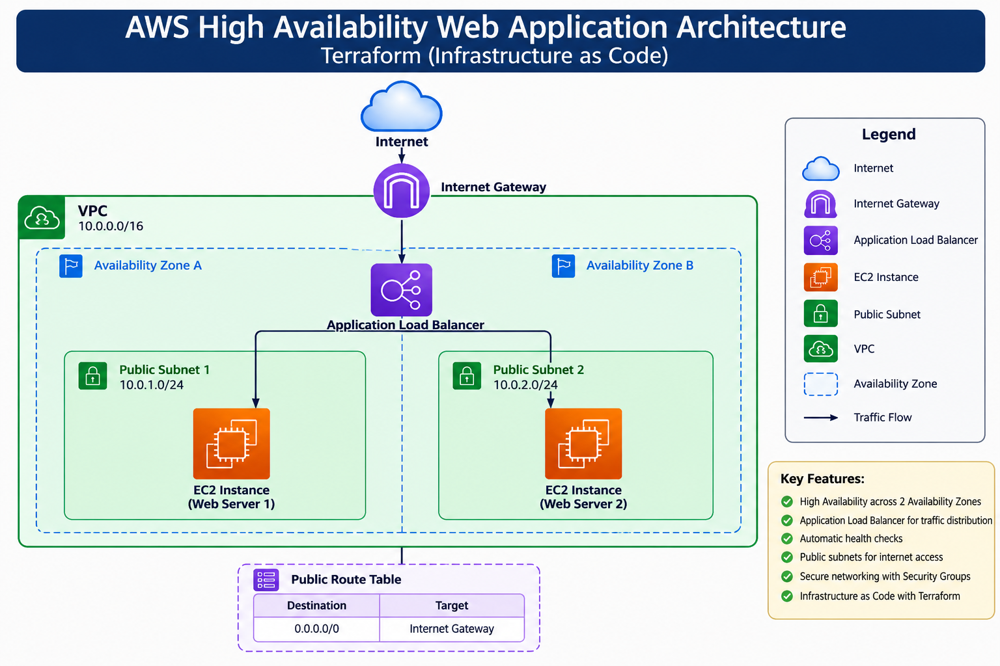

# 🚀 Terraform AWS High Availability Web Application

<p align="center">


</p>

<p align="center">

### 🚀 Deploying a Highly Available Web Application on AWS using Terraform

**Provisioning production-style AWS infrastructure with Infrastructure as Code (IaC)**

</p>

---

## 📖 Project Overview

This project demonstrates how to provision a **Highly Available Web Application** on **Amazon Web Services (AWS)** using **Terraform**.

Instead of manually creating AWS resources through the AWS Console, the entire infrastructure is defined as code, allowing it to be deployed, modified, and destroyed in a repeatable and automated manner.

The deployed infrastructure includes a custom **Virtual Private Cloud (VPC)**, multiple **Public Subnets**, an **Internet Gateway**, **Route Tables**, **Security Groups**, two **EC2 web servers**, and an **Application Load Balancer (ALB)** that distributes incoming traffic between the servers.

Each EC2 instance automatically installs and configures **Apache HTTP Server** using **User Data scripts**, eliminating manual server configuration and ensuring every deployment is identical.

This project follows Infrastructure as Code (IaC) principles and demonstrates Terraform fundamentals including resource creation, dependency management, variables, outputs, and automated provisioning on AWS.

---

# 🎯 Project Objectives

The primary objectives of this project are:

- Automate AWS infrastructure provisioning using Terraform
- Build a Highly Available Web Application
- Deploy resources across multiple Availability Zones
- Implement Infrastructure as Code (IaC) best practices
- Configure automatic web server installation using User Data
- Distribute traffic using an AWS Application Load Balancer
- Learn Terraform resource dependencies
- Understand AWS networking fundamentals
- Practice real-world Terraform workflows
- Build a portfolio-ready DevOps project

---

# ✨ Key Features

✅ Infrastructure as Code (Terraform)

✅ Highly Available Architecture

✅ Custom Amazon VPC

✅ Multiple Public Subnets

✅ Internet Gateway

✅ Route Tables

✅ Security Groups

✅ EC2 Web Servers

✅ Automated Apache Installation

✅ Application Load Balancer (ALB)

✅ Health Checks

✅ Target Groups

✅ Variables & Outputs

✅ Repeatable Deployments

✅ Easy Cleanup using `terraform destroy`

---

# 🏗️ Architecture

The infrastructure follows a High Availability architecture by deploying two EC2 instances into separate Availability Zones.

Incoming traffic first reaches the **Application Load Balancer**, which performs health checks on both EC2 instances before forwarding requests only to healthy targets.

This architecture improves:

- High Availability
- Fault Tolerance
- Scalability
- Reliability
- Load Distribution

---

## 📐 Architecture Diagram

> **Replace the image below with your own architecture screenshot.**

```md

```

---

# 🌐 Infrastructure Workflow

```text
                     Internet
                         │
                         │
                ┌────────▼────────┐
                │ Application     │
                │ Load Balancer   │
                └────────┬────────┘
                         │
          ┌──────────────┴──────────────┐
          │                             │
          ▼                             ▼
 ┌────────────────┐             ┌────────────────┐
 │   Web Server 1 │             │   Web Server 2 │
 │    Apache      │             │    Apache      │
 └────────────────┘             └────────────────┘
          │                             │
          ▼                             ▼
   Public Subnet 1               Public Subnet 2
          │                             │
          └──────────────┬──────────────┘
                         ▼
                     Amazon VPC
                         │
                  Internet Gateway
```

---

# 💡 Why Terraform?

Terraform enables infrastructure to be managed using code instead of manual configuration.

Benefits include:

- Version Controlled Infrastructure
- Reproducible Deployments
- Automation
- Easy Rollback
- Collaboration
- Multi-Cloud Support
- Declarative Configuration
- Reduced Human Errors

---

# 🚀 Technologies Used

| Category | Technology |
|-----------|------------|
| Cloud Provider | AWS |
| IaC | Terraform |
| Compute | Amazon EC2 |
| Networking | Amazon VPC |
| Load Balancer | AWS ALB |
| Web Server | Apache2 |
| Operating System | Ubuntu |
| Version Control | Git |
| Repository | GitHub |

---

# ☁️ AWS Services Used

| Service | Purpose |
|----------|----------|
| Amazon VPC | Isolated Virtual Network |
| Public Subnet | Host EC2 Instances |
| Internet Gateway | Internet Connectivity |
| Route Table | Route Internet Traffic |
| Security Group | Firewall Rules |
| Amazon EC2 | Web Servers |
| Application Load Balancer | Load Distribution |
| Target Group | Backend Targets |
| Listener | Forward HTTP Requests |

---

# 📸 Project Demo

After deployment:

- Both EC2 instances become **Healthy**
- ALB starts forwarding requests
- Refreshing the ALB DNS alternates between:
  - 🖥️ Web Server 1
  - 🖥️ Web Server 2

This demonstrates successful High Availability using AWS Application Load Balancer.

---

## 📌 Project Status

> ✅ Completed

**Current Features**

- ✅ VPC
- ✅ Public Subnets
- ✅ Internet Gateway
- ✅ Route Tables
- ✅ Security Group
- ✅ EC2 Instances
- ✅ Apache Web Server
- ✅ User Data Automation
- ✅ Application Load Balancer
- ✅ Target Group
- ✅ Listener
- ✅ Terraform Variables
- ✅ Outputs
- ✅ Infrastructure Cleanup

---

# 📂 Project Structure

The project is organized by separating AWS resources into individual Terraform configuration files. This modular structure improves readability, simplifies maintenance, and follows Infrastructure as Code (IaC) best practices.

```text
terraform-aws-ha-webapp/
│
├── images/
│   ├── architecture.png
│   ├── ec2-instances.png
│   ├── load-balancer.png
│   ├── target-group.png
│   ├── web-server-1.png
│   ├── web-server-2.png
│   ├── terraform-plan.png
│   ├── terraform-apply.png
│   └── terraform-destroy.png
│
├── userdata/
│   ├── server1.sh
│   └── server2.sh
│
├── provider.tf
├── versions.tf
├── variables.tf
├── terraform.tfvars.example
├── outputs.tf
│
├── vpc.tf
├── subnet.tf
├── igw.tf
├── route-table.tf
├── security-group.tf
├── ec2.tf
├── alb.tf
│
├── .gitignore
├── LICENSE
└── README.md
```

---

# 📁 File Explanation

Every file in this repository has a dedicated purpose.

---

## 📄 provider.tf

This file configures the AWS provider that Terraform uses to communicate with your AWS account.

It defines:

- AWS Provider
- AWS Region
- Authentication using AWS CLI credentials

Example:

```hcl
provider "aws" {
  region = var.aws_region
}
```

---

## 📄 versions.tf

This file locks the Terraform version and provider version.

Using version constraints ensures consistent deployments across different machines.

Example:

```hcl
terraform {
  required_version = ">= 1.12.0"

  required_providers {
    aws = {
      source  = "hashicorp/aws"
      version = "~> 6.0"
    }
  }
}
```

---

## 📄 variables.tf

This file contains all configurable input variables.

Instead of hardcoding values throughout the project, variables make the infrastructure reusable and easier to maintain.

Examples include:

- AWS Region
- VPC CIDR Block
- Public Subnet CIDRs
- Instance Type
- AMI ID

Benefits:

- Reusability
- Cleaner code
- Easier deployments
- Better scalability

---

## 📄 terraform.tfvars.example

This file contains sample values for project variables.

Users can copy this file and rename it to:

```text
terraform.tfvars
```

before deployment.

Example:

```hcl
aws_region = "us-east-1"

instance_type = "t2.micro"

ami_id = "ami-xxxxxxxxxxxxxxxxx"
```

---

## 📄 outputs.tf

Outputs display important information after deployment.

Examples:

- ALB DNS Name
- EC2 Public IP
- VPC ID

This allows users to quickly access deployed resources.

---

# 🌐 Networking Resources

---

## 📄 vpc.tf

Creates the Virtual Private Cloud.

The VPC provides an isolated network for all AWS resources deployed in this project.

Responsibilities:

- Create VPC
- Assign CIDR Block
- Enable isolated networking

---

## 📄 subnet.tf

Creates two Public Subnets.

Each subnet resides in a different Availability Zone to improve fault tolerance.

Benefits:

- High Availability
- Multi-AZ Deployment
- Fault Isolation

---

## 📄 igw.tf

Creates an Internet Gateway.

This gateway enables communication between the VPC and the public Internet.

Without an Internet Gateway:

- EC2 cannot access the Internet
- Users cannot access the web application

---

## 📄 route-table.tf

Creates a Public Route Table.

The route table forwards Internet traffic through the Internet Gateway.

Responsibilities:

- Create Route Table
- Configure Default Route
- Associate Public Subnets

---

# 🔐 Security Resources

---

## 📄 security-group.tf

Creates the Security Group used by both EC2 instances and the Application Load Balancer.

Allowed Traffic:

| Port | Protocol | Purpose |
|-------|----------|----------|
| 22 | TCP | SSH Access |
| 80 | TCP | HTTP Traffic |

Outbound traffic is fully allowed.

---

# 💻 Compute Resources

---

## 📄 ec2.tf

Creates two Ubuntu EC2 instances.

Each instance:

- Launches in a different Public Subnet
- Receives a Public IP Address
- Automatically installs Apache
- Deploys a custom HTML page using User Data

The two servers are intentionally different.

Server One displays:

```text
Web Server 1
```

Server Two displays:

```text
Web Server 2
```

This allows users to visually confirm that the Application Load Balancer is distributing requests correctly.

---

# ⚖️ Load Balancer

---

## 📄 alb.tf

Creates the complete Application Load Balancer infrastructure.

Resources created:

- Application Load Balancer
- Target Group
- Listener
- Target Group Attachments

The ALB continuously performs health checks before forwarding requests to healthy EC2 instances.

---

# 🖥 User Data Scripts

The project uses EC2 User Data to automate server configuration during instance launch.

This eliminates manual server setup.

---

## 📄 userdata/server1.sh

Responsibilities:

- Update Ubuntu packages
- Install Apache HTTP Server
- Enable Apache
- Start Apache
- Deploy custom landing page
- Display "Web Server 1"

---

## 📄 userdata/server2.sh

Responsibilities:

- Update Ubuntu packages
- Install Apache HTTP Server
- Enable Apache
- Start Apache
- Deploy custom landing page
- Display "Web Server 2"

---

# 📸 Infrastructure Components

The deployed infrastructure includes:

✅ Amazon VPC

✅ Two Public Subnets

✅ Internet Gateway

✅ Public Route Table

✅ Route Table Associations

✅ Security Group

✅ Two EC2 Web Servers

✅ Apache HTTP Server

✅ Application Load Balancer

✅ Target Group

✅ Listener

✅ Health Checks

---

# 🔄 Terraform Resource Dependency

Terraform automatically determines resource creation order based on dependencies.

Deployment Flow:

```text
Provider
      │
      ▼
VPC
      │
      ▼
Subnets
      │
      ▼
Internet Gateway
      │
      ▼
Route Table
      │
      ▼
Security Group
      │
      ▼
EC2 Instances
      │
      ▼
Application Load Balancer
      │
      ▼
Target Group
      │
      ▼
Listener
```

Terraform ensures that dependent resources are created only after the required infrastructure is available.

---

# 📌 Infrastructure Summary

| Resource | Count |
|-----------|------:|
| VPC | 1 |
| Public Subnets | 2 |
| Internet Gateway | 1 |
| Route Table | 1 |
| Route Table Associations | 2 |
| Security Group | 1 |
| EC2 Instances | 2 |
| Apache Servers | 2 |
| Application Load Balancer | 1 |
| Target Group | 1 |
| Listener | 1 |

---

# ⚙️ Prerequisites

Before deploying this project, ensure the following tools and services are available.

| Requirement | Version |
|-------------|----------|
| AWS Account | Active |
| Terraform | v1.12+ |
| AWS CLI | Latest |
| Git | Latest |
| VS Code (Optional) | Latest |
| SSH Client | OpenSSH / MobaXterm |

---

# ☁️ AWS Account Setup

Create an AWS account if you don't already have one.

After logging in, create an IAM User with **Programmatic Access**.

The IAM user should have permissions to create:

- VPC
- EC2
- Security Groups
- Internet Gateway
- Route Tables
- Elastic Load Balancer

For learning purposes, the **AdministratorAccess** policy can be used.

> **Note:** In production environments, always follow the Principle of Least Privilege (PoLP) and grant only the permissions required.

---

# 🔐 Configure AWS CLI

Verify AWS CLI is installed:

```bash
aws --version
```

Configure your credentials:

```bash
aws configure
```

Example:

```text
AWS Access Key ID: ********************
AWS Secret Access Key: ********************
Default region name: us-east-1
Default output format: json
```

Verify authentication:

```bash
aws sts get-caller-identity
```

Successful output confirms Terraform can authenticate with AWS.

---

# 📥 Clone the Repository

Clone the repository from GitHub.

```bash
git clone https://github.com/revanth-bl/terraform-aws-ha-webapp.git
```

Move into the project directory.

```bash
cd terraform-aws-ha-webapp
```

---

# 📦 Initialize Terraform

Terraform must download the AWS Provider before deployment.

Run:

```bash
terraform init
```

Expected output:

```text
Terraform has been successfully initialized!
```

This command downloads:

- AWS Provider
- Provider plugins
- Terraform dependencies

---

# 🧹 Format Terraform Files

Format all Terraform files before validation.

```bash
terraform fmt
```

Benefits:

- Consistent formatting
- Improved readability
- Best practice before committing code

---

# ✅ Validate Configuration

Validate Terraform syntax.

```bash
terraform validate
```

Expected output:

```text
Success! The configuration is valid.
```

Validation checks:

- Syntax
- Resource references
- Variable references
- Dependency graph

---

# 📋 Review the Execution Plan

Preview the infrastructure before creating resources.

```bash
terraform plan
```

Terraform displays:

- Resources to create
- Resources to modify
- Resources to destroy

Example:

```text
Plan: 15 to add, 0 to change, 0 to destroy.
```

Review the plan carefully before proceeding.

---

# 🚀 Deploy the Infrastructure

Provision the infrastructure.

```bash
terraform apply
```

Terraform asks for confirmation.

```text
Do you want to perform these actions?

Enter a value:
```

Type:

```text
yes
```

Terraform begins provisioning AWS resources.

Deployment usually completes within **2–5 minutes**.

---

# 🏗️ Deployment Workflow

Terraform provisions resources in dependency order.

```text
Initialize Provider
        │
        ▼
Create VPC
        │
        ▼
Create Public Subnets
        │
        ▼
Attach Internet Gateway
        │
        ▼
Create Route Table
        │
        ▼
Associate Route Table
        │
        ▼
Create Security Group
        │
        ▼
Launch EC2 Instances
        │
        ▼
Execute User Data Scripts
        │
        ▼
Install Apache
        │
        ▼
Create Application Load Balancer
        │
        ▼
Create Target Group
        │
        ▼
Register Targets
        │
        ▼
Create Listener
        │
        ▼
Infrastructure Ready
```

---

# 📤 Terraform Outputs

After deployment Terraform displays useful outputs.

Example:

```text
Apply complete!

Outputs:

alb_dns_name = "terraform-alb-xxxxxxxx.us-east-1.elb.amazonaws.com"

webserver1_public_ip = "44.xxx.xxx.xxx"

webserver2_public_ip = "3.xxx.xxx.xxx"

vpc_id = "vpc-xxxxxxxx"
```

These outputs are defined inside:

```text
outputs.tf
```

---

# 🌐 Verify the Deployment

Open the ALB DNS Name in your browser.

Example:

```text
http://terraform-alb-xxxxxxxx.us-east-1.elb.amazonaws.com
```

The page should display:

```text
AWS High Availability Web Application

Web Server 1
```

Refresh the browser several times.

The Application Load Balancer should automatically distribute requests between:

```text
Web Server 1
```

and

```text
Web Server 2
```

This confirms that load balancing is functioning correctly.

---

# ❤️ Verify Target Health

Navigate to:

```text
AWS Console
→ EC2
→ Target Groups
→ Targets
```

Expected status:

```text
WebServer-1   Healthy

WebServer-2   Healthy
```

Healthy targets indicate that:

- Apache is running
- Security Group rules are correct
- User Data executed successfully
- ALB Health Checks are passing

---

# 📸 Recommended Screenshots

Capture screenshots for documentation.

Recommended screenshots:

- Terraform Init
- Terraform Validate
- Terraform Plan
- Terraform Apply
- EC2 Dashboard
- VPC Dashboard
- Public Subnets
- Internet Gateway
- Route Table
- Security Group
- Load Balancer
- Target Group
- Web Server 1
- Web Server 2
- Successful ALB Page

Store them inside:

```text
images/
```

---

# 🧪 Testing the Infrastructure

Verify the following:

| Test | Expected Result |
|------|-----------------|
| terraform validate | Success |
| terraform plan | No Errors |
| terraform apply | Successful |
| EC2 Instances | Running |
| Apache | Installed |
| ALB | Active |
| Target Group | Healthy |
| Browser Access | Working |
| Load Balancing | Verified |

---

# 🧹 Destroy the Infrastructure

To avoid AWS charges, destroy all resources after testing.

```bash
terraform destroy
```

Terraform requests confirmation.

```text
Enter a value:
```

Type:

```text
yes
```

Terraform deletes all managed resources.

Expected output:

```text
Destroy complete!

Resources: 15 destroyed.
```

---

# 💰 AWS Cost Considerations

This project uses billable AWS resources, including:

- Amazon EC2
- Application Load Balancer
- Elastic IPs (if allocated)
- Data Transfer

Always destroy the infrastructure after completing the project to prevent unnecessary costs.

---

# 📌 Deployment Summary

✅ AWS CLI Configured

✅ Terraform Initialized

✅ Configuration Validated

✅ Infrastructure Planned

✅ Infrastructure Deployed

✅ Apache Installed Automatically

✅ Application Load Balancer Created

✅ Health Checks Passed

✅ Traffic Successfully Distributed Between Both EC2 Instances

✅ Infrastructure Successfully Destroyed After Testing

---

# ⚙️ Prerequisites

Before deploying this project, ensure the following tools and services are available.

| Requirement | Version |
|-------------|----------|
| AWS Account | Active |
| Terraform | v1.12+ |
| AWS CLI | Latest |
| Git | Latest |
| VS Code (Optional) | Latest |
| SSH Client | OpenSSH / MobaXterm |

---

# ☁️ AWS Account Setup

Create an AWS account if you don't already have one.

After logging in, create an IAM User with **Programmatic Access**.

The IAM user should have permissions to create:

- VPC
- EC2
- Security Groups
- Internet Gateway
- Route Tables
- Elastic Load Balancer

For learning purposes, the **AdministratorAccess** policy can be used.

> **Note:** In production environments, always follow the Principle of Least Privilege (PoLP) and grant only the permissions required.

---

# 🔐 Configure AWS CLI

Verify AWS CLI is installed:

```bash
aws --version
```

Configure your credentials:

```bash
aws configure
```

Example:

```text
AWS Access Key ID: ********************
AWS Secret Access Key: ********************
Default region name: us-east-1
Default output format: json
```

Verify authentication:

```bash
aws sts get-caller-identity
```

Successful output confirms Terraform can authenticate with AWS.

---

# 📥 Clone the Repository

Clone the repository from GitHub.

```bash
git clone https://github.com/revanth-bl/terraform-aws-ha-webapp.git
```

Move into the project directory.

```bash
cd terraform-aws-ha-webapp
```

---

# 📦 Initialize Terraform

Terraform must download the AWS Provider before deployment.

Run:

```bash
terraform init
```

Expected output:

```text
Terraform has been successfully initialized!
```

This command downloads:

- AWS Provider
- Provider plugins
- Terraform dependencies

---

# 🧹 Format Terraform Files

Format all Terraform files before validation.

```bash
terraform fmt
```

Benefits:

- Consistent formatting
- Improved readability
- Best practice before committing code

---

# ✅ Validate Configuration

Validate Terraform syntax.

```bash
terraform validate
```

Expected output:

```text
Success! The configuration is valid.
```

Validation checks:

- Syntax
- Resource references
- Variable references
- Dependency graph

---

# 📋 Review the Execution Plan

Preview the infrastructure before creating resources.

```bash
terraform plan
```

Terraform displays:

- Resources to create
- Resources to modify
- Resources to destroy

Example:

```text
Plan: 15 to add, 0 to change, 0 to destroy.
```

Review the plan carefully before proceeding.

---

# 🚀 Deploy the Infrastructure

Provision the infrastructure.

```bash
terraform apply
```

Terraform asks for confirmation.

```text
Do you want to perform these actions?

Enter a value:
```

Type:

```text
yes
```

Terraform begins provisioning AWS resources.

Deployment usually completes within **2–5 minutes**.

---

# 🏗️ Deployment Workflow

Terraform provisions resources in dependency order.

```text
Initialize Provider
        │
        ▼
Create VPC
        │
        ▼
Create Public Subnets
        │
        ▼
Attach Internet Gateway
        │
        ▼
Create Route Table
        │
        ▼
Associate Route Table
        │
        ▼
Create Security Group
        │
        ▼
Launch EC2 Instances
        │
        ▼
Execute User Data Scripts
        │
        ▼
Install Apache
        │
        ▼
Create Application Load Balancer
        │
        ▼
Create Target Group
        │
        ▼
Register Targets
        │
        ▼
Create Listener
        │
        ▼
Infrastructure Ready
```

---

# 📤 Terraform Outputs

After deployment Terraform displays useful outputs.

Example:

```text
Apply complete!

Outputs:

alb_dns_name = "terraform-alb-xxxxxxxx.us-east-1.elb.amazonaws.com"

webserver1_public_ip = "44.xxx.xxx.xxx"

webserver2_public_ip = "3.xxx.xxx.xxx"

vpc_id = "vpc-xxxxxxxx"
```

These outputs are defined inside:

```text
outputs.tf
```

---

# 🌐 Verify the Deployment

Open the ALB DNS Name in your browser.

Example:

```text
http://terraform-alb-xxxxxxxx.us-east-1.elb.amazonaws.com
```

The page should display:

```text
AWS High Availability Web Application

Web Server 1
```

Refresh the browser several times.

The Application Load Balancer should automatically distribute requests between:

```text
Web Server 1
```

and

```text
Web Server 2
```

This confirms that load balancing is functioning correctly.

---

# ❤️ Verify Target Health

Navigate to:

```text
AWS Console
→ EC2
→ Target Groups
→ Targets
```

Expected status:

```text
WebServer-1   Healthy

WebServer-2   Healthy
```

Healthy targets indicate that:

- Apache is running
- Security Group rules are correct
- User Data executed successfully
- ALB Health Checks are passing

---

# 📸 Recommended Screenshots

Capture screenshots for documentation.

Recommended screenshots:

- Terraform Init
- Terraform Validate
- Terraform Plan
- Terraform Apply
- EC2 Dashboard
- VPC Dashboard
- Public Subnets
- Internet Gateway
- Route Table
- Security Group
- Load Balancer
- Target Group
- Web Server 1
- Web Server 2
- Successful ALB Page

Store them inside:

```text
images/
```

---

# 🧪 Testing the Infrastructure

Verify the following:

| Test | Expected Result |
|------|-----------------|
| terraform validate | Success |
| terraform plan | No Errors |
| terraform apply | Successful |
| EC2 Instances | Running |
| Apache | Installed |
| ALB | Active |
| Target Group | Healthy |
| Browser Access | Working |
| Load Balancing | Verified |

---

# 🧹 Destroy the Infrastructure

To avoid AWS charges, destroy all resources after testing.

```bash
terraform destroy
```

Terraform requests confirmation.

```text
Enter a value:
```

Type:

```text
yes
```

Terraform deletes all managed resources.

Expected output:

```text
Destroy complete!

Resources: 15 destroyed.
```

---

# 💰 AWS Cost Considerations

This project uses billable AWS resources, including:

- Amazon EC2
- Application Load Balancer
- Elastic IPs (if allocated)
- Data Transfer

Always destroy the infrastructure after completing the project to prevent unnecessary costs.

---

# 📌 Deployment Summary

✅ AWS CLI Configured

✅ Terraform Initialized

✅ Configuration Validated

✅ Infrastructure Planned

✅ Infrastructure Deployed

✅ Apache Installed Automatically

✅ Application Load Balancer Created

✅ Health Checks Passed

✅ Traffic Successfully Distributed Between Both EC2 Instances

✅ Infrastructure Successfully Destroyed After Testing

---

# 📸 Project Walkthrough

This section demonstrates the successful deployment of the infrastructure and validates that each AWS component was created correctly.

---

# 🖼️ Deployment Screenshots

> **Note:** Replace the image paths below with your own screenshots.

---

## 🏗️ Terraform Initialization

Terraform downloads the required AWS provider plugins and initializes the working directory.

```text
terraform init
```

```md

```

---

## ✅ Terraform Validation

Terraform validates the configuration files and confirms there are no syntax errors.

```text
terraform validate
```

Expected Output:

```text
Success! The configuration is valid.
```

```md

```

---

## 📋 Terraform Plan

Terraform previews every resource that will be created before deployment.

```text
terraform plan
```

Expected:

```text
Plan: 15 to add, 0 to change, 0 to destroy.
```

```md

```

---

## 🚀 Terraform Apply

Terraform provisions the complete AWS infrastructure.

```text
terraform apply
```

Expected:

```text
Apply complete!
```

```md

```

---

# ☁️ AWS Infrastructure

---

## Amazon VPC

The Virtual Private Cloud acts as the isolated network for every AWS resource deployed in this project.

```md

```

---

## Public Subnets

Two Public Subnets were created in separate Availability Zones.

Benefits:

- High Availability
- Fault Isolation
- Better Reliability

```md

```

---

## Internet Gateway

The Internet Gateway allows resources inside the VPC to communicate with the Internet.

```md

```

---

## Route Table

The Public Route Table forwards Internet traffic to the Internet Gateway.

```md

```

---

## Security Group

The Security Group acts as the virtual firewall.

Allowed Inbound Rules:

| Port | Purpose |
|------|----------|
| 22 | SSH |
| 80 | HTTP |

```md

```

---

# 💻 Amazon EC2

Two Ubuntu EC2 instances were successfully launched.

Each instance automatically:

- Installed Apache
- Started Apache
- Enabled Apache Service
- Created a custom landing page

```md

```

---

# ⚖️ Application Load Balancer

The Application Load Balancer receives incoming requests and distributes them across both EC2 instances.

Features:

- Layer 7 Load Balancer
- Health Checks
- Automatic Request Routing

```md

```

---

# 🎯 Target Group

The Target Group continuously monitors both EC2 instances.

Healthy Targets:

```text
WebServer-1

Healthy

WebServer-2

Healthy
```

```md

```

---

# 🌐 Application Demo

The deployed web application is accessible through the ALB DNS Name.

Opening the ALB URL displays:

## Request Routed to Web Server 1

```md

```

---

Refreshing the page routes the request to another EC2 instance.

## Request Routed to Web Server 2

```md

```

---

This confirms that the Application Load Balancer is distributing traffic successfully.

---

# 🔄 Request Flow

```text
                 Internet
                      │
                      ▼
       Application Load Balancer
                      │
        ┌─────────────┴─────────────┐
        ▼                           ▼
 Web Server 1                 Web Server 2
        │                           │
        ▼                           ▼
 Apache HTTP Server         Apache HTTP Server
```

---

# 🔍 Infrastructure Validation

The deployment was verified using the following checklist.

| Validation | Status |
|------------|--------|
| Terraform Init | ✅ |
| Terraform Validate | ✅ |
| Terraform Plan | ✅ |
| Terraform Apply | ✅ |
| AWS Provider | ✅ |
| VPC Created | ✅ |
| Public Subnets Created | ✅ |
| Internet Gateway Attached | ✅ |
| Route Table Associated | ✅ |
| Security Group Created | ✅ |
| EC2 Instance 1 Running | ✅ |
| EC2 Instance 2 Running | ✅ |
| Apache Installed | ✅ |
| ALB Created | ✅ |
| Target Group Created | ✅ |
| Listener Created | ✅ |
| Health Checks Passed | ✅ |
| Web Application Accessible | ✅ |
| Load Balancing Verified | ✅ |
| Terraform Destroy Successful | ✅ |

---

# 🛠 Troubleshooting

During development, several issues were encountered and resolved.

---

## Issue 1

### Problem

Terraform validation failed due to placeholder (`...`) content left in multiple `.tf` files.

### Solution

Removed placeholder content and completed each Terraform resource definition.

---

## Issue 2

### Problem

`server1.sh` was empty, causing Apache not to install.

Result:

```text
Web Server 1

Unhealthy
```

### Solution

Added the Apache installation commands and recreated the EC2 instance using:

```bash
terraform apply -replace="aws_instance.webserver1"
```

The Target Group then reported:

```text
Healthy
```

---

## Issue 3

### Problem

Only one web server responded through the ALB.

### Root Cause

The second EC2 instance was healthy while the first failed the health check due to missing User Data.

### Resolution

Updated the User Data script and replaced the affected instance.

---

## Issue 4

### Problem

Terraform warnings related to Base64 encoded User Data.

### Resolution

Reviewed the warning and confirmed that `user_data` was functioning correctly for this project.

---

# 📚 Key Learnings

This project provided practical experience with:

- Infrastructure as Code
- Terraform resource management
- AWS networking
- VPC architecture
- EC2 provisioning
- Security Groups
- Application Load Balancer
- Target Groups
- Health Checks
- User Data automation
- Terraform Outputs
- Terraform Variables
- Infrastructure troubleshooting
- Resource replacement
- Infrastructure lifecycle management

---

# 🎯 Interview Questions

### Why use Terraform instead of manually creating resources?

Terraform automates infrastructure deployment, enables version control, and provides repeatable, consistent environments.

---

### What is a VPC?

A Virtual Private Cloud is an isolated network where AWS resources are deployed securely.

---

### Why use an Application Load Balancer?

An ALB distributes incoming HTTP/HTTPS requests across multiple targets, improving availability and fault tolerance.

---

### What is User Data?

User Data is a script executed automatically when an EC2 instance launches, commonly used to install software and configure the instance.

---

### Why deploy EC2 instances in different Availability Zones?

To improve fault tolerance and ensure the application remains available if one Availability Zone experiences an outage.

---

# 🚀 Future Enhancements

The current project is intentionally simple for learning purposes.

Potential production-ready improvements include:

- Auto Scaling Group (ASG)
- HTTPS with AWS Certificate Manager (ACM)
- Route 53 custom domain
- Remote Terraform State (Amazon S3)
- DynamoDB state locking
- Terraform Modules
- GitHub Actions CI/CD
- AWS WAF integration
- CloudWatch monitoring and alarms
- Bastion Host for secure SSH access
- NAT Gateway for private subnets
- Private EC2 instances
- Multi-environment deployments (Dev, Stage, Prod)

---

---

# 📊 Project Highlights

This project demonstrates the practical implementation of Infrastructure as Code (IaC) by automating the deployment of a Highly Available Web Application on Amazon Web Services using Terraform.

Unlike manual provisioning through the AWS Console, every infrastructure component is defined as code, allowing the entire environment to be recreated consistently with a single command.

### Key Achievements

- ✅ Designed and deployed a custom Amazon VPC
- ✅ Created Public Subnets across multiple Availability Zones
- ✅ Configured Internet Gateway and Route Tables
- ✅ Implemented Security Groups with inbound and outbound rules
- ✅ Provisioned two EC2 Ubuntu instances
- ✅ Automated Apache installation using EC2 User Data
- ✅ Configured an AWS Application Load Balancer
- ✅ Registered EC2 instances with Target Groups
- ✅ Enabled Health Checks
- ✅ Successfully validated High Availability
- ✅ Managed infrastructure entirely using Terraform
- ✅ Cleaned up infrastructure using `terraform destroy`

---

# 📈 Skills Demonstrated

This project demonstrates practical experience with the following technologies and concepts.

## Cloud

- Amazon Web Services (AWS)
- Virtual Private Cloud (VPC)
- Amazon EC2
- Application Load Balancer
- Security Groups
- Route Tables
- Internet Gateway

---

## Infrastructure as Code

- Terraform
- Providers
- Variables
- Outputs
- Resource Dependencies
- State Management
- Infrastructure Lifecycle

---

## Linux

- Ubuntu
- Bash Scripting
- Apache HTTP Server
- EC2 User Data

---

## DevOps

- Infrastructure Automation
- Cloud Networking
- High Availability
- Load Balancing
- Infrastructure Validation
- Troubleshooting

---

# 🏆 Learning Outcomes

Completing this project helped reinforce several core DevOps and Cloud concepts.

✔ Infrastructure as Code

✔ AWS Networking

✔ VPC Design

✔ EC2 Deployment

✔ Terraform Resource Management

✔ User Data Automation

✔ Application Load Balancer

✔ Health Checks

✔ High Availability

✔ Infrastructure Debugging

✔ Repeatable Deployments

✔ Cloud Cost Awareness

---

# 📝 Challenges Faced

Like most real-world cloud deployments, the project required troubleshooting and iterative improvements.

Some of the challenges included:

- Terraform validation errors
- Incorrect resource references
- Placeholder Terraform blocks
- Empty EC2 User Data script
- Unhealthy Target Group
- Apache installation verification
- Load Balancer health checks
- Infrastructure recreation using `terraform apply -replace`
- Managing Terraform outputs

Resolving these issues provided valuable hands-on troubleshooting experience beyond simply following deployment steps.

---

# 🔐 Security Considerations

This project is intended for educational purposes.

For production environments, additional security improvements should include:

- IAM Roles instead of static credentials
- Least Privilege IAM Policies
- Private Subnets
- NAT Gateway
- Bastion Host
- AWS Systems Manager Session Manager
- HTTPS using ACM
- AWS WAF
- CloudTrail
- GuardDuty
- Security Hub

---

# 🚀 Possible Enhancements

Future improvements that could transform this project into a production-ready architecture include:

## Infrastructure

- Auto Scaling Group (ASG)
- Launch Templates
- NAT Gateway
- Private Subnets
- Multi-AZ Database
- Route 53
- CloudFront

---

## Terraform

- Remote State (Amazon S3)
- DynamoDB State Locking
- Terraform Modules
- Reusable Components
- Multiple Environments (Dev / Stage / Prod)
- Workspaces

---

## DevOps

- GitHub Actions
- Jenkins Pipeline
- Terraform Cloud
- Atlantis
- Pre-Commit Hooks

---

## Monitoring

- Amazon CloudWatch
- CloudWatch Dashboard
- SNS Notifications
- AWS X-Ray
- Prometheus
- Grafana

---

# 🤝 Contributing

Contributions are welcome.

If you would like to improve this project:

1. Fork the repository

2. Create a feature branch

```bash
git checkout -b feature/new-feature
```

3. Commit your changes

```bash
git commit -m "Add new feature"
```

4. Push the branch

```bash
git push origin feature/new-feature
```

5. Open a Pull Request

---

# 📄 License

This project is licensed under the MIT License.

Feel free to use, modify, and distribute it for educational and personal purposes.

See the **LICENSE** file for additional details.

---

# 👨‍💻 Author

## Revanth

Cloud & DevOps Enthusiast

### Connect with me

GitHub:

```text
https://github.com/revanth-bl
```

---

# ⭐ Support

If you found this project useful:

⭐ Star this repository

🍴 Fork the project

🛠 Share suggestions and improvements

Your support helps motivate the creation of more open-source DevOps projects.

---

# 🙏 Acknowledgements

Special thanks to:

- HashiCorp for Terraform
- Amazon Web Services
- Apache HTTP Server
- The DevOps community
- Open-source contributors whose documentation and examples make learning cloud technologies more accessible

---

# 📚 References

## Terraform

https://developer.hashicorp.com/terraform/docs

---

## AWS Documentation

https://docs.aws.amazon.com/

---

## AWS Provider

https://registry.terraform.io/providers/hashicorp/aws/latest/docs

---

## AWS CLI

https://docs.aws.amazon.com/cli/

---

# 📌 Repository Status

> **Project Status:** ✅ Completed

Current Version:

```text
v1.0.0
```

Infrastructure:

- ✅ VPC
- ✅ Public Subnets
- ✅ Internet Gateway
- ✅ Route Table
- ✅ Security Group
- ✅ EC2 Instances
- ✅ Apache Web Server
- ✅ Application Load Balancer
- ✅ Target Group
- ✅ Listener
- ✅ Health Checks

Deployment:

- ✅ Terraform Init
- ✅ Terraform Validate
- ✅ Terraform Plan
- ✅ Terraform Apply
- ✅ Terraform Destroy

Documentation:

- ✅ Architecture Diagram
- ✅ Screenshots
- ✅ Deployment Guide
- ✅ Troubleshooting
- ✅ Learning Outcomes

---

<div align="center">

# 🚀 Terraform AWS High Availability Web Application

### Infrastructure as Code • AWS • Terraform • DevOps

**Built with ❤️ using Terraform and Amazon Web Services**

⭐ **If you enjoyed this project, don't forget to star the repository!**

</div>